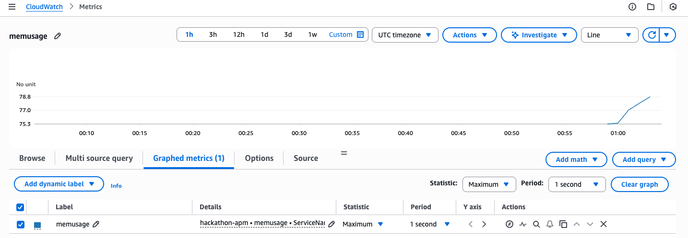

# Appointment Service

A Flask-based appointment service that allow customers to create appointment.

## Features

- Create appointments via REST API
- Memory usage monitoring with OpenTelemetry

## How to Run

### Prerequisites

- Python 3.x
- Flask
- psutil
- opentelemetry-distro[aws]

### Installation

```bash
pip install flask psutil opentelemetry-distro[aws]
```

### Running with OpenTelemetry

To run the service with AWS OpenTelemetry configuration:

```bash
export OTEL_PYTHON_DISTRO=aws_distro && \
export OTEL_TRACES_EXPORTER=none && \
export OTEL_LOGS_EXPORTER=none && \
export OTEL_METRICS_EXPORTER=awsemf && \
export OTEL_PYTHON_CONFIGURATOR=aws_configurator && \
export OTEL_EXPORTER_OTLP_LOGS_HEADERS=x-aws-log-group=hackathon-apm,x-aws-log-stream=default,x-aws-metric-namespace=hackathon-apm && \
export OTEL_RESOURCE_ATTRIBUTES=service.name=AppointmentService,aws.log.group.names=hackathon-apm && \
opentelemetry-instrument python app.py
```

The service will start on `http://localhost:5000`

## API Endpoints

### Create Appointment

```bash
curl -X POST http://localhost:5000/createAppointment \
  -H "Content-Type: application/json" \
  -d '{
    "patient_name": "Jane Smith",
    "doctor_name": "Dr. Johnson",
    "appointment_date": "2024-01-20",
    "appointment_time": "2:00 PM",
    "notes": "Follow-up visit"
  }'
```

## Traffic Generation

To trigger traffic and demonstrate memory leak behavior, use the following script to create multiple appointments:

```bash
# Create multiple appointments to demonstrate memory leak
echo -e "\n\nCreating multiple appointments to demonstrate memory leak..."
for i in {1..200}; do
  curl -s -X POST http://localhost:5000/createAppointment \
    -H "Content-Type: application/json" \
    -d "{
      \"patient_name\": \"Patient $i\",
      \"doctor_name\": \"Dr. Test\",
      \"appointment_date\": \"2024-01-25\",
      \"appointment_time\": \"$((9 + i % 8)):00 AM\",
      \"notes\": \"Test appointment $i\"
    }" > /dev/null
  
  sleep 0.1
done
```

This will create 200 appointments with a 100ms delay between each request, demonstrating the memory leak pattern.

## Metrics

The service exports the following OpenTelemetry metrics:

- `MemUsage`: Memory usage in MB with `ServiceName: AppointmentService` attribute
